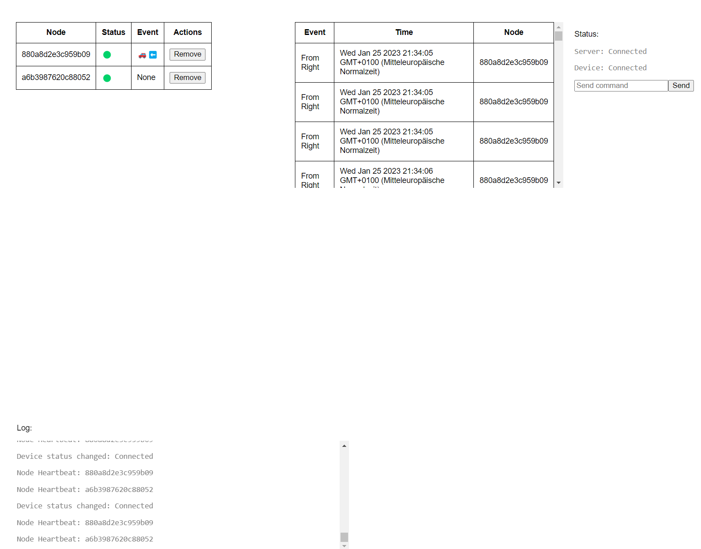

# Vernetzte Straßen

<p align='center'>
    <a href='./README.md'>English</a> |Deutsch
</p>

Dieses Projekt soll dazu dienen mittels mehrerer Nordic nRF52840 Dongles und angeschlossenen Mikrofonen den Straßenverkehr zu überwachen, um evtl. darauf aufbauend Verkehrsinformationen zu extrahieren.

Siehe auch die [Dokumentation](https://gitlab.plagge.it/fh-aachen/ip/vernetzte-strassen/-/wikis/home) für mehr Infos.



## Features

- [x] Verbindungung mehrerer Knoten zu einem Mesh Netzwerk
- [x] Senden von Befehlen von einer Weboberfläche an die Nodes
- [x] Aufzeichnung von Audio-Rohdaten
- [x] Übertragung von Audio-Rohdaten
- [x] Knoten als Gateway zum Internet
- [x] Extrahieren von Verkehrsinformationen aus Audio-Rohdaten
- [ ] Übertragung von Verkehrsinformationen an eine Weboberfläche

## Hardware

- [Nordic nRF52840 Dongle](https://www.nordicsemi.com/Software-and-tools/Development-Kits/nRF52840-Dongle)
- [Mikrofone]()

## Software

- [Zephyr RTOS](https://www.zephyrproject.org/)

## Installation

### Zephyr

Für detailierte Installationsanleitungen der Entwicklungsumgebung siehe [Getting Started](https://gitlab.plagge.it/fh-aachen/ip/vernetzte-strassen/-/wikis/Ressources/Development%20Setup).

Ist die Entwicklungsumgebung erfolgreich aufgesetzt, muss das Projekt gebuilded werden:

    git clone https://gitlab.plagge.it/fh-aachen/ip/vernetzte-strassen.git
    git checkout server
    west build -b nrf52840dongle_nrf52840 .

**Oder** es kann direkt ein Release von der [Release Seite](https://gitlab.plagge.it/fh-aachen/ip/vernetzte-strassen/-/releases) benutzt werden. Diese .hex Datei dann einfach im nRF Programmer auswählen und flashen.

Danach kann einer der Dongles angeschlossen werden und über das nRF Programmer Tool aus der nRF Connect Toolbox geflashed werden. Alle Knoten benutzen den selben Build.

Anschließend per UART (unter Windows z.B: puTTY) mit der BAUD rate 115200 verbinden. Wenn nun der Button auf den Dongles innerhalb der ersten 5 Sekunden gedrückt wird, konfiguriert das Gerät sich als Provisioner, sodass es das Mesh Netzwerk verwaltet. Ansonsten wird es als Node konfiguriert und dem Mesh Netzwerk beigetreten. Sollte der Button nach den 5 Sekunden gedrückt werden und das Dongle ist noch nicht provisioniert wurden, provisioniert es sich selber mit Test-IDs.

Wenn nach erfolgreicher Provisionierung der Button gedrückt wird, sendet der Knoten eine Test Nachricht an das Mesh Netzwerk.

### Auswertung

Das Auswertungsskript startet einen TCP-Server und wartet auf Messdaten im folgenden Format (big endian):

```
int32: left channel
int32: right channel
int64: timestamp
```

Sobald ein Ereignis erkannt wurde erfolgt eine Ausgabe in stdout.

Der entsprechende Container kann folgendermaßen gebaut werden:

```
git checkout auswertung
cd detector
podman build -t detector .
```

Ausführung z.B. mit:

```
podman run --rm -it -p 12345:5678 -e LISTEN_PORT=1234 detector
```

### Server

Die Weboberfläche ist in TypeScript geschrieben und kann wie folgt erstellt werden:

    cd server
    npm i
    npm run dev # oder npm run prod

Diese ist dann unter [http://localhost:3000](http://localhost:3000) erreichbar. Vorher sollte noch die `server/.env` Datei angepasst werden:

    NODE_ENV=development
    WINDOW_SIZE_MS=900000
    MAX_CONNECTIONS_PER_WINDOW=10000
    PORT=3000
    SERIAL_PORT=COM11
    # RPI: SERIAL_PORT=/dev/ttyACM0
    BAUD_RATE=115200
    SERVER_URL=http://localhost

Hierbei ist besonders SERIAL_PORT relevant, da dieser je nach Port, Gerät unterschiedlich ist. Bei Windows ist dies meistens `COM11`, bei Linux `ttyACM0` o.a.

`WINDOW_SIZE_MS` ist die Größe eines Fensters in MS, in denen `MAX_CONNECTIONS_PER_WINDOW` hergestellt werden können. Wenn diese Anzahl überschritten wird, wird der Nutzer vorübergehend gesperrt.

Nach Starten und Auswählen des korrekten Ports, werden die verbundenen Nodes in der Übersicht angezeigt, sowie auch deren Status. Mittels der `Send command` Box können Textnachrichten an die Nodes gesendet werden.

### Mikrofone

Das Auslesen der I2S-Mikrofone funktioniert derzeit nicht.

Der 2-Kanal I2S Schnittstelle sind folgende Ports zugewiesen:

- SCK: P0.29
- LRCK: P1.15
- SDIN: P0.02

Mittels folgendem Befehl kann der Audio-Input ausgelesen werden:

    git checkout microphone-i2s
    west build -b nrf52840dongle_nrf52840 .

Wieder mit nRF Programmer Tool flashen und anschließend per UART (unter Windows z.B: puTTY) mit der BAUD rate 115200 verbinden.
